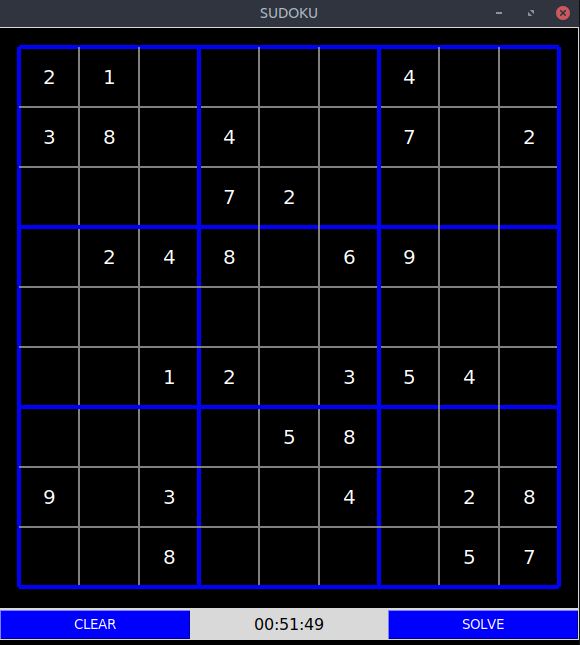
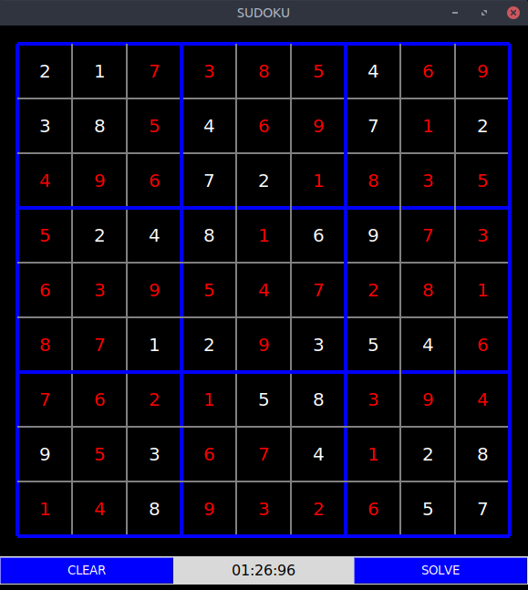

## Sudoku
This is my implementation of the one of most popular puzzles - [Sudoku](https://en.wikipedia.org/wiki/Sudoku) using Python's GUI library, [TkInter](https://docs.python.org/3/library/tkinter.html). The logic of the application involves the ***backtracking*** algorithm.

 

It includes the following functionalities:
1. A timer which tracks the time taken to complete the puzzle.
2. In case you are stuck, solver displays the answer for you.
3. Event handling of the GUI interface.
4. Three difficulty levels - Easy, Medium & Hard.

### Instructions
Install TkInter:
```
$ sudo apt-get install python3-tk
```
Clone the repository:
```
$ git clone https://github.com/sid-jpr/Sudoku-GUI
```
Run the file:
```
$ python3 sudoku.py --board [level]
```

### References
- [Python Sudoku Solver - Computerphile](https://www.youtube.com/watch?v=G_UYXzGuqvM)
- [Stopwatch in TkInter - Active State Recipes](http://code.activestate.com/recipes/124894-stopwatch-in-tkinter/)
